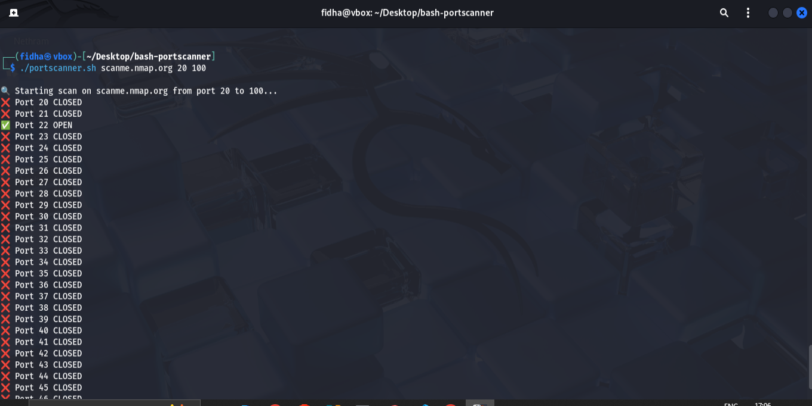

# 🔒 Bash Port Scanner

This is a simple Bash-based port scanner that checks for open ports on a given host.

## 🛠️ How to Use

```bash
chmod +x portscanner.sh
./portscanner.sh <IP> <start_port> <end_port>
```
## 🖼️ Screenshot

Here’s a sample output of the port scanner:


